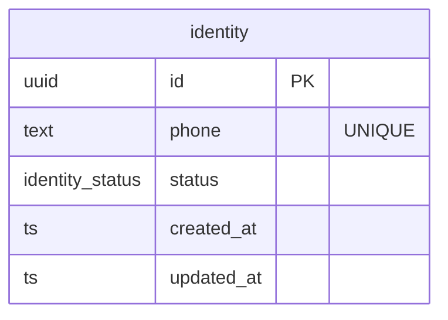

# Doorman — схема данных

## База данных

```mermaid
erDiagram
    identity {
        uuid            id         PK
        text            phone      "UNIQUE"
        identity_status status
        ts              created_at
        ts              updated_at
    }
```

## Перечисления

| Тип | Значения |
|-----|----------|
| `identity_status` | `active`, `blocked`, `deleted` |
