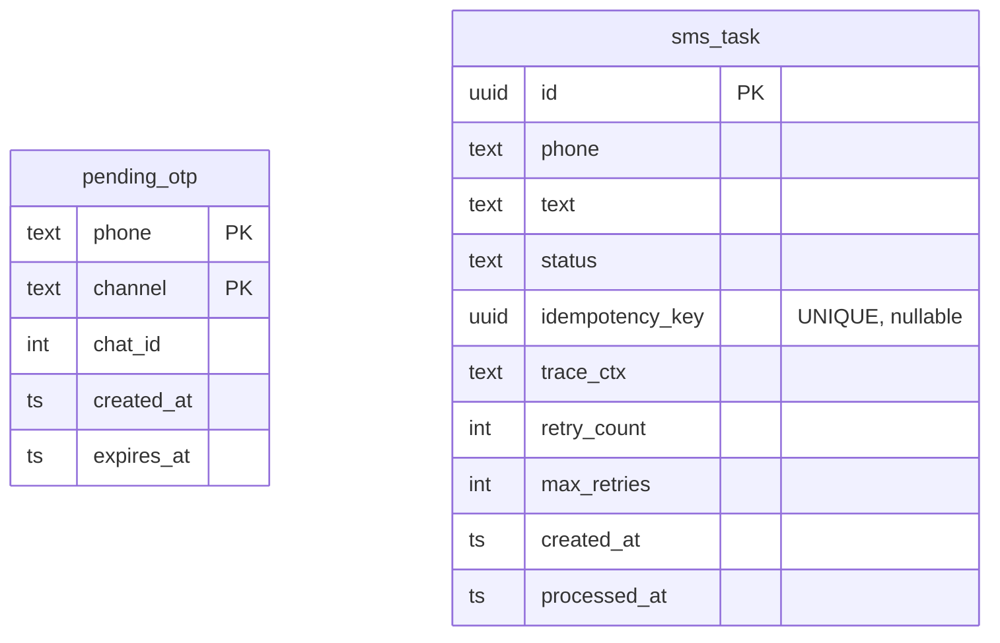

# Herald — схема данных

## База данных

```mermaid
erDiagram
    pending_otp {
        text  phone      PK
        text  channel    PK
        int   chat_id
        ts    created_at
        ts    expires_at
    }

    sms_task {
        uuid  id               PK
        text  phone
        text  text
        text  status
        uuid  idempotency_key  "UNIQUE, nullable"
        text  trace_ctx
        int   retry_count
        int   max_retries
        ts    created_at
        ts    processed_at
    }
```

`pending_otp.channel` — строковое поле: `tg`, `sms`.

`sms_task.status` — строковое поле: `pending`, `sent`.
