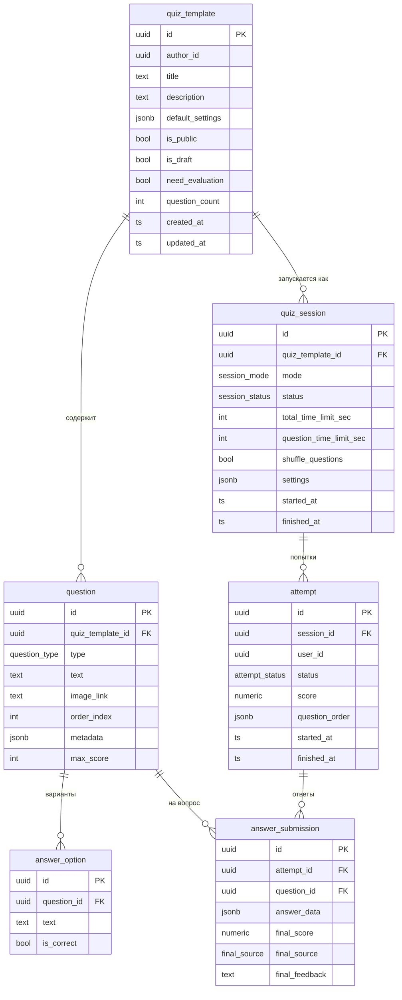

# Riddler — схема данных и события

## База данных



## Типы сессий

| mode | Описание |
|------|----------|
| `test` | Студент проходит самостоятельно (библиотека или курс) |
| `live` | Учитель ведёт урок в реальном времени |

| status | Описание |
|--------|----------|
| `draft` | Создана, не активна |
| `active` | Студенты могут создавать попытки |
| `finished` | Закрыта, новые попытки невозможны |

## NATS-события (Riddler публикует)

| Subject | Payload | Когда |
|---------|---------|-------|
| `riddler.quiz_template.attached` | `{quiz_template_id, module_id}` | POST /quizzes с `attach_to_module` |
| `riddler.course_session.created` | `{session_id, module_id}` | POST /sessions (курсовая сессия) |
| `riddler.attempt.created` | `{attempt_id, session_id, user_id}` | POST /sessions/:id/attempts |
| `riddler.attempt.scored` | `{attempt_id, session_id, user_id, total_score}` | POST /attempts/:id/finish (после автооценки) |

Caesar подписывается на все четыре события и создаёт/обновляет записи в своей БД.

## Сессия библиотеки vs курсовая сессия

```
Библиотека                          Курс
──────────────────────────────────────────────────────
Одна session на всех студентов      Одна session на весь класс/группу
Создаётся автоматически             Создаётся учителем явно (POST /sessions)
  при PublishQuiz (is_public=true)
Настройки из default_settings       Настройки задаются вручную
  квиза                               (time_limit, shuffle, finished_at)
Без дедлайна                        С дедлайном (finished_at)
course_item — отсутствует           course_item type=quiz, object_id=session_id
```
