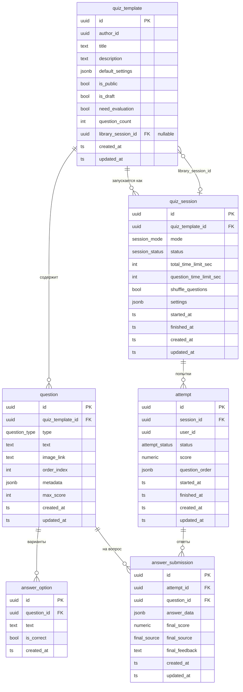

# Riddler — схема данных

## База данных

## Перечисления

| Тип | Значения |
|-----|----------|
| `session_mode` | `live`, `test` |
| `session_status` | `not_started`, `waiting`, `active`, `running`, `finished` |
| `attempt_status` | `in_progress`, `grading`, `graded`, `completed` |
| `final_source` | `auto`, `llm`, `teacher` |
| `question_type` | `single_choice`, `multiple_choice`, `with_given_answer`, `with_free_answer`, `drag`, `connection` |

## NATS-события (Riddler публикует)

| Subject | Payload | Когда |
|---------|---------|-------|
| `riddler.quiz_template.attached` | `{quiz_template_id, module_id}` | POST /quizzes с `attach_to_module` |
| `riddler.course_session.created` | `{session_id, module_id}` | POST /sessions/test или /sessions/live |
| `riddler.attempt.created` | `{attempt_id, session_id, user_id}` | POST /sessions/:id/attempts |
| `riddler.attempt.scored` | `{attempt_id, session_id, user_id, total_score}` | POST /attempts/:id/finish (после автооценки) |

Caesar подписывается на все четыре события и создаёт/обновляет записи в своей БД.
